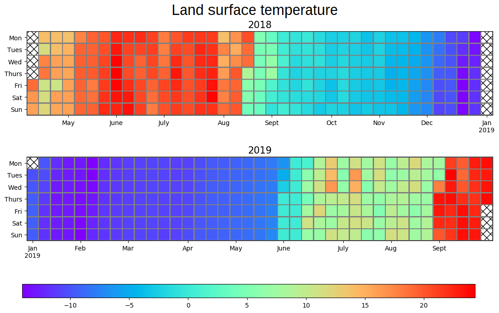

## **Exploratory-data-analysis-of-Yedoma-complex-of-the-Lena-River-delta**

This repository contains codes created within my internship at Alfred Wegener Institute for Polar and Marine Research. The official name of the internship's project is *Analysis of surface temperature data
and topography from Yedoma complex of the Lena River delta.* 

Different kind of visualisation have been created and different techniques were performed: 
* boxplots 
* linecharts 
* scatter plots
* correlation heatmap
* calendar heatmap

